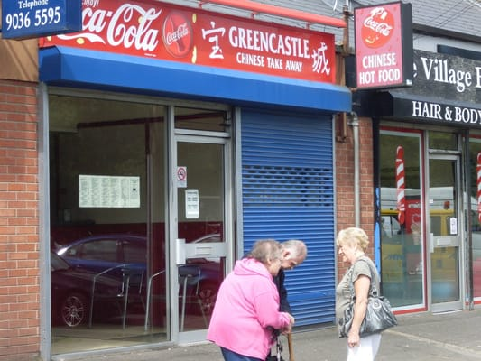

This post is for test reasons relating to Hugo vs Gatsby from an SEO perspective. 

Salty, spicy, wholesome goodness (badness). Chinese takeaway fuels the average Belfast household at least once per week - a monumental staple in our diet. But what are the best Chinese takeaways in North Belfast?

North Belfast is a beautiful part of the city with the Cavehill, Belfast Castle, and annual riots entertaining the eye. It's also where I was born and raised, so I'm fully qualified to present the best Chinese takeaways, North Belfast has to offer.

TL:DR - If you have no time to read the full post, I've included my top 5 below:

> 1. Greencastle Chinese, Shore Road
> 2. Crystal Palace, Ardoyne
> 3. Elements, Antrim Road
> 4. New Century, Old Park Road
> 5. Bowin, Shore Road
>

## 1. Greencastle Chinese, Shore Road

Controversial, is this Chinese in Belfast or Newtownabbey? Who cares, it's incredible. With a few owners over the years, the flavours this Chinese takeaway has dished out have changed; sometimes for the worse, but often for the better. The portions are not big but it's the quality and old school Chinese taste we visit this establishment for. Reasonably priced, give this Chinese a visit. It's nestled just off the M2, so commuting is easy but parking is a nightmare. Both the gravy and curry are incredible, and the chicken balls are more like tempura goujons - I would definitely recommend and it steals the crown of the best Chinese takeaway North Belfast has to offer.

[Location](https://www.google.com/maps/dir/54.5800192,-5.922816/directions+to+greencastle+chinese/@54.6149425,-5.9573236,13z/data=!3m1!4b1!4m9!4m8!1m1!4e1!1m5!1m1!1s0x4861a77e0a920a41:0x7b0a6d786ca6446d!2m2!1d-5.9193912!2d54.6494232)

**Overall Rating - 9/10**

## 2. Crystal Palace, Ardoyne

If you speak to anyone from Ardoyne and surrounding areas, they'll sing the praises of this local, long-standing North Belfast Chinese takeaway.  Once you first arrive at Crystal Palace you might be deterred with it's basic, dated appearance but stay strong. My girlfriend Amy is a strong believer that the best Chinese takeaways are the ones which look the worst from the outside - 'they let the food do the talking'. Their beef curry is incredible and the cost is average. An old-school Chinese takeaway with original flavours and quick service. Add this to your Chinese takeaway bucket list.

[Location](https://www.google.com/maps/dir/54.5800192,-5.922816/Crystal+Palace,+523+Crumlin+Rd,+Belfast+BT14+7GA/@54.5971648,-5.9607188,14z/data=!3m1!4b1!4m9!4m8!1m1!4e1!1m5!1m1!1s0x4861086d72bcdd8f:0x76684ba61f4e6702!2m2!1d-5.965439!2d54.614313)

**Overall Rating - 9/10**

## 3. Elements, Antrim Road

This Chinese opened around 10-15 years ago and from the day it opened its doors, it made a huge impact. The portions are big, the establishment is clean, and the service is efficient. A professional Chinese who know how to deliver time and time again. The black bean sauce is a must here, actually, everything's a must. With Elements, whatever you choose, you're guaranteed to be satisfied.

[Location](https://www.google.com/maps/dir/54.5800192,-5.922816/Elements+Chinese,+Antrim+Road,+Belfast/@54.5980594,-5.9653022,13z/data=!3m1!4b1!4m9!4m8!1m1!4e1!1m5!1m1!1s0x48610848051059cb:0x5d82d6dd99c06a86!2m2!1d-5.9374222!2d54.6161097)

**Overall Rating - 8/10**

##4. New Century, Old Park Road

I must admit,  I've only been to this Chinese twice but it's left a lasting impression. The salted chili chicken was crispy, tender and full of spicy goodness. On top of that, the portions are huge; possibly the biggest on this list. Who doesn't like big feckin' portions? A main meal, will happily do two, or a very hungry (drunk) one. The chili garlic beef was fantastic, and the food was not as infiltrated by MSG as other Chinese takeaways. Give this takeaway a go and you'll not be disappointed.

[Location](https://www.google.com/maps/dir/54.5800192,-5.922816/New+Century,+701+Oldpark+Rd,+Belfast+BT14+6QY/@54.6033606,-5.9782537,13z/data=!3m1!4b1!4m9!4m8!1m1!4e1!1m5!1m1!1s0x48610810945e6509:0x948e2f5ee4cff792!2m2!1d-5.9654305!2d54.6267121)

Overall Rating - 8/10

## 5. Bowin, Shore Road

Their curry is spicy, their fried rice is full of soy sauce and their portions are generous. What more could you want with a Chinese takeaway in North Belfast. They also do a great choy mein, once again, with tonnes of soy sauce. This Chinese takeaway will leave you with a smile and a thirst, so make sure you bring a glass of water to bed with you.

[Location](https://www.google.com/maps/dir/54.5800192,-5.922816/Bowin+Chinese+Take+Away,+592-592A+Shore+Rd,+Belfast/@54.6092254,-5.960009,13z/data=!3m1!4b1!4m9!4m8!1m1!4e1!1m5!1m1!1s0x486109d5ba000ec9:0x5f1c5d5fbedadb38!2m2!1d-5.9237135!2d54.6384378)

**Overall Rating - 7/10**

##

###Honourable mentions:

- Wai Kee, Antrim Road
- Clementine, Antrim Road
- Choys, Cliftonville Road

There you have it, my top 5 Chinese takeaways in North Belfast. Greencastle Chinese takeaway has stole the crown, but credit to Crystal Palace which offers an incredible authentic beef curry. The one to watch is New Century - I'll be exploring this option more in the next couple of months.
